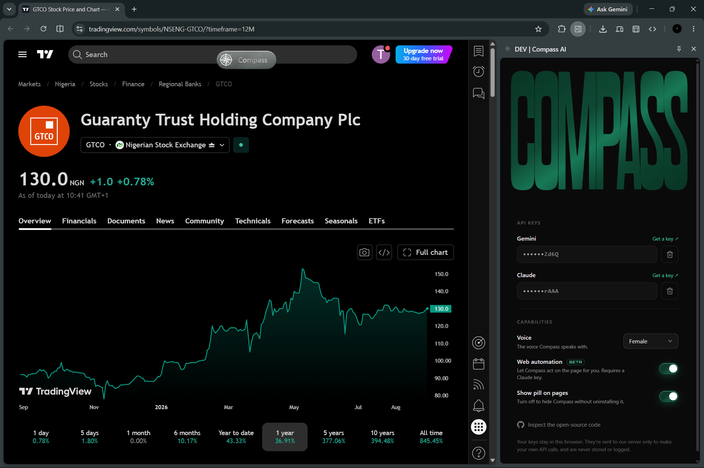

<h1 align="center">Compass AI</h1>

<p align="center">
  <strong>A voice copilot for the stock market.</strong><br />
  Talk to it. It watches your screen, researches stocks in real time, and drives the page for you — without ever going silent.
</p>

<p align="center">
  
</p>

<p align="center">
  <a href="LICENSE"></a>
  
  
  
</p>

---

## How it works

A persistent **Gemini Live** session owns the audio and never stops talking to the user (the *front desk*). Slow work — page automation, stock research — is dispatched as tool calls that return immediately to background workers (the *back office*); their results are injected back into the live session so the assistant speaks the answer without going silent.

- **Voice** — 16 kHz mic audio streamed up, PCM speech streamed back.
- **Vision** — a live screen stream lets it reason about the chart you're looking at.
- **Research** — Gemini + Google Search grounding, run async.
- **Action** — an Anthropic Claude agent drives real DOM actions via the Chrome DevTools Protocol.
- **Keys** — users bring their own; stored in-browser, used only for their own calls.

## Packages

| Path | Package | Purpose |
| --- | --- | --- |
| [apps/api](apps/api/) | `@compass-ai/api` | uWebSockets.js gateway, Gemini Live session, task manager, research + web agents |
| [apps/extension](apps/extension/) | `@compass-ai/extension` | Plasmo MV3 extension: pill UI, side panel, mic capture, audio playback, action execution |
| [packages/types](packages/types/) | `@compass-ai/types` | Shared WS wire-protocol and session/task types |

## Run it

```powershell
pnpm install
cp apps/api/.env.example apps/api/.env             # fill in — required at startup
cp apps/extension/.env.example apps/extension/.env
pnpm dev                                            # API + extension HMR
```

Load `apps/extension/build/chrome-mv3-dev/` as an unpacked extension at `chrome://extensions` (Developer mode on). The pill appears on every page.

Root tasks: `pnpm dev`, `pnpm build`, `pnpm typecheck` (Turborepo, `^build` ordered). Scope to one package with `pnpm --filter <name> <task>`.

## Contributing

Conventions and the wire-protocol change process are in [CONTRIBUTING.md](CONTRIBUTING.md): `strict` TypeScript, `pnpm typecheck` must pass, wire-protocol changes go through `packages/types` first, conventional commits.

## License

MIT — see [LICENSE](LICENSE).

> **Disclaimer:** An independent, unaffiliated project. Not affiliated with, endorsed by, or connected to any stockbroking platform. Any platform names referenced are the property of their owners and used only to describe sites this tool interoperates with.
